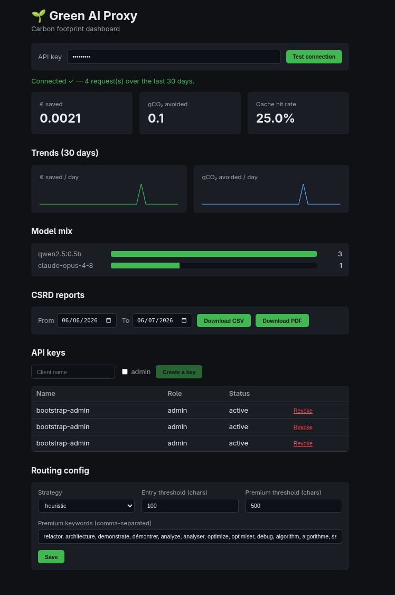

# gatewAI

[](https://github.com/YouriMartin/gatewAI/actions/workflows/ci.yml)
[](LICENSE)


Open-source, self-hosted LLM proxy for enterprises.
It secures, caches, routes and measures the carbon footprint of AI requests.




## Why gatewAI?

Enterprises are adopting LLMs but face three problems:

- **Cost** — redundant requests billed twice (or three times)
- **Privacy** — data flows through third parties with no control
- **Environmental impact** — no visibility into the carbon footprint of AI

gatewAI solves all three in a single infrastructure component.

## Architecture

A thin gateway built on a chain of Spring AI **Advisors**. End-to-end view:

```
        ┌──────────────┐        ┌──────────────────┐
        │ OpenAI SDK    │       │ MCP client        │
        │ (base_url →)  │       │ (Claude Desktop…) │
        └──────┬────────┘       └────────┬──────────┘
               │ /v1/chat/completions     │ /mcp
               ▼                          ▼
   ╔══════════════════════ gatewAI ══════════════════════╗
   ║  OpenAI ingress  +  MCP ingress   (API-key auth)    ║
   ║      │                                               ║
   ║      ▼  Spring AI Advisor chain                      ║
   ║  [1] Semantic cache    ─ hit → reply, 0 LLM call    ║
   ║  [2] Smart router      ─ optimal model (cost/CO2)   ║
   ║  [3] Green accounting  ─ € + gCO2 (+ avoided CO2)   ║
   ║      │                                               ║
   ║      ▼ egress                  Svelte dashboard  ◀───╫─ /
   ║  real ChatModel                /actuator/prometheus ◀╫─ Prometheus+Grafana
   ╚══════╪═══════════════════════════════╪══════════════╝
          │                               │
   ┌──────▼──────┐  ┌──────────────┐  ┌───▼──────────────────┐
   │ Any provider │  │ Ollama        │ │ PostgreSQL + pgvector │
   │ mix: Ollama, │  │ (embeddings + │ │ vector cache +        │
   │ vLLM, Claude,│  │  local models)│ │ relational metrics    │
   │ OpenAI…      │  │               │ │                       │
   └──────────────┘  └──────────────┘  └──────────────────────┘
```

**Ingress** (OpenAI or MCP format) and **egress** (LLM provider) are
independent. Any existing client SDK works by only changing the `base_url`,
and the egress side is **bring-your-own-model-mix**: local-first by default
(everything runs on the bundled Ollama, zero API keys), with any combination of
provider instances — several Ollama/vLLM servers, Anthropic, OpenAI, any
OpenAI-compatible endpoint — declared in configuration. No vendor is required
or privileged. Per-layer details: see [`docs/`](docs/README.md) (carbon,
observability, MCP, native image).

## Tech stack

| Component | Technology |
|---|---|
| Language | Java 25 (Virtual Threads + Scoped Values) |
| Framework | Spring Boot 4, Spring AI 2.0 |
| Database | PostgreSQL + pgvector (vector cache + metrics) |
| Embeddings | Ollama + nomic-embed-text (768 dim, 100% on-premise) |
| Local infra | Docker Compose |
| Build | Maven (wrapper included) |

## Prerequisites

- **Docker** and **Docker Compose** (enough for plug & play mode)
- **Java 25** + Maven *(only for development mode)*

No API key is required: by default all three routing tiers run on the bundled
Ollama. Cloud providers (Anthropic, OpenAI, any OpenAI-compatible endpoint) are
opt-in via the model registry.

## Quick start — plug & play (all in containers)

No JDK required: Docker builds the app (back end + dashboard) and starts the whole
stack.

```bash
# 1. Clone the project
git clone https://github.com/YouriMartin/gatewAI.git
cd gatewAI

# 2. (Optional) configure secrets — admin key, cloud API keys
cp .env.example .env

# 3. Start the full stack (gateway + Postgres/pgvector + Ollama)
docker compose -f docker-compose.yml up --build
```

> `compose.yaml` (infra only) is used in dev mode and takes precedence when you
> run `docker compose` without `-f`; the full stack is therefore invoked
> explicitly with `-f docker-compose.yml`.

- Dashboard: <http://localhost:8080/>
- OpenAI API: `POST http://localhost:8080/v1/chat/completions`
- MCP server: `http://localhost:8080/mcp` (see [`docs/technical/mcp.md`](docs/technical/mcp.md))
- Health: <http://localhost:8080/actuator/health>

On the **first** start, the gateway downloads the embedding model
(`nomic-embed-text`) and the three default chat models (`qwen2.5` 0.5b/1.5b/3b,
~3 GB total) from Ollama — give the health check time to pass. To route a tier
to a cloud model instead, see the *Egress providers* section of
[`application.properties`](src/main/resources/application.properties).

Your **admin API key** is simply the `GATEWAI_ADMIN_API_KEY` you set in `.env` —
the gateway seeds an admin client with that exact key at startup. Use it as the
`Authorization: Bearer …` token for `/v1/admin/**`.

> If you leave `GATEWAI_ADMIN_API_KEY` blank, a random admin key is generated and
> printed **once** in the logs instead:
> `docker compose -f docker-compose.yml logs gateway | grep "Admin API key"`.
> (A `Using generated security password: <uuid>` line, if present, is an unrelated
> Spring default — not your API key.)

## Development mode (local JDK, hot reload)

The quickest way is the dev environment script (manages infra + backend):

```bash
scripts/dev.sh start      # Postgres + Ollama (compose.yaml) + backend (mvnw spring-boot:run)
scripts/dev.sh restart    # bounce the backend only (infra stays up)
scripts/dev.sh stop       # stop backend + infra (data kept)
scripts/dev.sh status     # status, URLs; `logs` to tail, `clean` to wipe volumes
```

It reads secrets from `.env`. Equivalent manual steps:

```bash
# Boot starts Postgres + Ollama via compose.yaml; the app runs on the JVM
./mvnw spring-boot:run
```

For the dashboard with **hot reload** (separate, in either case):

```bash
cd src/main/frontend && npm run dev   # Vite on :5173, proxies /v1 → :8080
```

> Use the dev script **or** the full container stack
> (`docker compose -f docker-compose.yml up`), not both — they share ports and the
> Compose project name.

## Useful commands

```bash
# Tests (fast, no Node, no containers)
./mvnw test

# Full build: tests + Checkstyle + SpotBugs
./mvnw verify

# Infra only, without the app (dev mode)
docker compose -f compose.yaml up -d

# Optional observability stack (Prometheus + Grafana)
docker compose -f docker-compose.observability.yml up -d

# Stop the full plug & play stack
docker compose -f docker-compose.yml down
```

## Features

### Semantic cache
Intercepts similar requests before any LLM call.
Cuts cost and latency by short-circuiting redundant calls.

### Smart routing
Sends each request to the cheapest/leanest model able to handle it:
local (Ollama) for simple tasks, cloud premium for complex ones.

### Carbon accounting
Measures the footprint (tokens → kWh → gCO2) and computes the CO2 avoided thanks
to the cache and routing. CSRD-compatible reporting export.

## Documentation

Full index: [`docs/`](docs/README.md). Curated entry points:

**Using it** (`docs/functional/`)
- [Getting started](docs/functional/getting-started.md) — deploy, get a key, first request (OpenAI + MCP)
- [Overview](docs/functional/overview.md) · [Features](docs/functional/features.md) · [Dashboard guide](docs/functional/dashboard-guide.md)
- [Limitations](docs/functional/limitations.md) — what it does *not* do (read before relying on the numbers)

**Understanding it** (`docs/technical/`)
- [Architecture](docs/technical/architecture.md) — start here: hexagonal layers, advisor chain, request lifecycle
- [API reference](docs/technical/api-reference.md) · [Semantic cache](docs/technical/semantic-cache.md) · [Routing](docs/technical/routing.md) · [Green accounting](docs/technical/green-accounting.md)
- [Security](docs/technical/security.md) · [Build & packaging](docs/technical/build-and-packaging.md) · [Decision records (ADRs)](docs/technical/adr/README.md)

**Working on it** (`docs/developpment/`)
- [Contributing](docs/developpment/contributing.md) — build, test, conventions, how to make common changes
- [Post-v1 roadmap](docs/developpment/roadmap-post-v1.md)

## License

[MIT](LICENSE)
